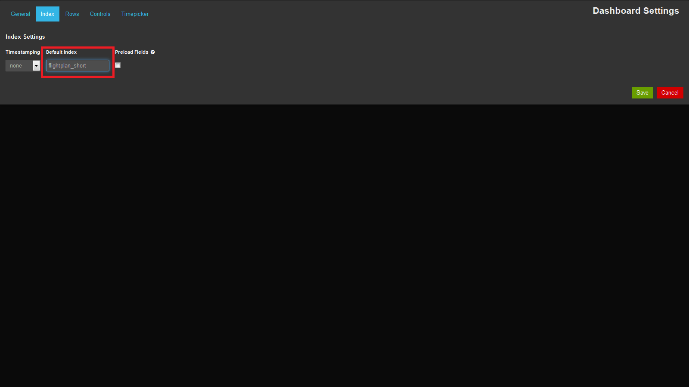
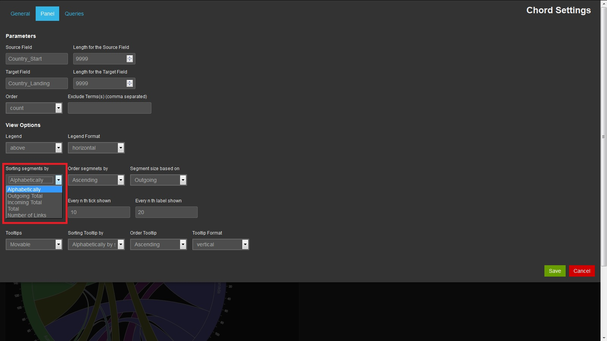

# Tutorial for a Chord Diagram in Kibana
In this tutorial we will go through the process of creating and interpreting chord diagrams in Kibana.

**FIGURE 1**

To get the best learning experience the tutorial is built in form of a case study about flight plans between different countries and cities. 
During the tutorial we will built the chord diagram and change some aspects of the layout for the diagram as we go along. 
When we are changing the layout we are doing so with specific questions about the data in mind.

At the end of the tutorial we will have done the following things:
- Loaded data into Elastcisearch
- Created a chord diagram
- Modified the settings to best suit the asked question about the data

## The Dataset and Getting Data into Elasticsearch
Before we can start to build our first chord diagram we have to load the required data into Elasticsearch. 
The data is loaded into Elasticsearch as JSON documents and stored as indices. The index we will use for this tutorial is called "flightplan_short".
In this tutorial we assume it is already known how to load data into Elasticsearch and it will not be explained further.

Let’s also take a look at the data we will be using. [Table 1](#ChordTable1) shows an extract of the data. 
The complete dataset is attached to this tutorial as an excel sheet and a JSON document (Please note: All numbers of the dataset are fictive and should just help for the case study).

<a name="ChordTable1">
<table>
	<tr>
		<td>Country_Connection</td><td>Country_Start</td><td>Country_Landing</td><td>City_Connection</td><td>City_Start</td><td>City_Landing</td><td>Timestamp</td>
	</tr>
	<tr>
		<td>Germany-Australia</td><td>Germany</td><td>Australia</td><td>Berlin-Brisbane</td><td>Berlin</td><td>Brisbane</td><td>2014-05-02T10:00:00</td>
	</tr>
	<tr>
		<td>Australia-England</td><td>Australia</td><td>England</td><td>Sydney-London</td><td>Sydney</td><td>London</td><td>2014-04-19T10:00:00</td>
	</tr>
	<tr>
		<td>England-Canada</td><td>England</td><td>Canada</td><td>Bristol-Toronto</td><td>Bristol</td><td>Toronto</td><td>2014-05-02T10:00:00</td>
	</tr>
</table>
</a>

**TABLE 1**

The dataset contains information about flights between different cities. The dataset also stores information about the day when the flight departed and the countries in which the cities are.
Although the data is fictive, it shows some kind of distribution. For example, on some days more flights are departing than on others, some cities have more flights departing 
and arriving than others, and between some countries are more connections than between others. Later we will see how these distributions are visible in the chord diagram.

More information about the dataset can be seen in the excel sheet. We will now start with creating the chord diagram.

## Creating a New Chord Diagram Panel
Before we can can create a chord diagram panel, we have to create or adjust a dashboard in Kibana and define the index which should be used for the dashboard. 
If you already know how to create a dashboard you can jump to the next chapter.

To create a new dashboard we open Kibana and select "3. Blank Dashboard" as shown on [Figure 2](#ChordFigure2).

**FIGURE 2**

After that we define some basic settings for the dashboard by going to *Configure dashboard* ([Figure 3](#ChordFigure3)).

**FIGURE 3**

We will set the *Default Index* to our index "flightplan_short" ([Figure 4](#ChordFigure4)) and set the *Time Field* to "Timestamp" ([Figure 5](#ChordFigure5)). "Timestamp" is the field in our data which 
contains the time information about our data. If you have several fields in your data which contains time information you have to select one field.

**FIGURE 4**

**FIGURE 5**

After we have changed the *Default Index* and *Time Field* we can add a new row to the dashboard. For that we go to the tab *Rows* and define the *height* of the row. 
We can also give a *title* to the row if we want. At the end we click *Create Row* and *Save* ([Figure 6](#ChordFigure6)).

**FIGURE 6**

Great, we have created a new dashboard with one row where we can place our chord diagram panel. 

## Creating a Chord Diagram
To show a chord diagram in our dashboard we have to add a panel by clicking *Add panel to empty row* ([Figure 7](#ChordFigure7)). 

**FIGURE 7**

In the drop-down list we select "chord" ([Figure 8](#ChordFigure8)).

**FIGURE 8**

We are now asked for some settings for our chord diagram ([Figure 9](#ChordFigure9)). For the beginning we will leave most of the fields in the default state. 
We resize the panel to "6" under *Span* and change some of the parameters. We will change the *Source Field* to “Country_Start” and its 
length to "9999". We also change the *Target Field* to "Country_Landing" and the length to "9999". Everything else remains in the default state ([Figure 10](#ChordFigure10)).

**FIGURE 9**

**FIGURE 10**

After we have saved our changes we get a diagram like the one in [Figure 11](#ChordFigure11).

**FIGURE 11**

The diagram gives us a first impression about the data. Each arc represents one country and the chords between them represent the number of flights between these countries. 
The chords are differently wide at the ends. If we look at the chord between Australia and France we see that the chord is thicker on the Australian side. With the current settings 
(see [Figure 10](#ChordFigure10)) the width of the chords represent the number of flights leaving a country. So, if 38 flights are going from Australia to France but only 23 go the other way, the width 
of the chord on the Australian side will be 38 and on the French side 23. The width of the arc for a country is the same as the sum of all chords connected to the arc. So, the width of 
an arc represents the sum of departing flights for this country. The diagram shows us that there are more flights leaving from countries like, the USA, Australia or Canada, than 
Germany, France or England. The width of the arcs also shows that there are more flights leaving in Germany to the USA, Australia and Canada, than to France and England. The chord diagram 
also shows connections from and to the same country.

The color of the curves also indicates the value of the connection. The color always indicates the country which has a higher value. As there are more people flying from Australia to 
France than the other way around and we are displaying the departing flights, the color of the curve matches the color of Australia.

## Changing the Segment Size
Let's assume we are not interested in the number of flights leaving a country, but the number of flights arriving in the country. To visualize these information we change the 
*Segment size based on* to "Incoming" in the configurations ([Figure 12](#ChordFigure12)).

**FIGURE 12**

The new diagram ([Figure 13](#ChordFigure13)) looks very similar to the previous one ([Figure 11](#ChordFigure11)), but it's not. The segments of France and England are bigger than before which means 
that there are more flights arriving in these countries than departing.

**FIGURE 13**

We can also show the arriving and departing flights at the same time. Therefore we change the field *Directed* to "Undirected" ([Figure 14](#ChordFigure14)). In a new diagram the size of the segments will 
correlate to the number of arriving and departing flights.

**FIGURE 14**

## Ordering the Segments
In the sections before we already made some comparisons between different countries. For example, we said that there are more flights departing in the USA, Canada, and Australia, 
than in the three European countries. But how about the number of departures between the USA and Canada? If we use the settings from [Figure 10](#ChordFigure10) again and look at [Figure 11](#ChordFigure11) 
it is hard to say which country has more departures. Even the ticks shown at the boundary of the segments don't help, as they are not detailed enough. To answer this question nevertheless we can 
modify the diagram in two ways.

First, we can increase the number of ticks and labels. Therefore, we adjust the fields *Every n th tick shown* and *Every n th label shown* to "10" and "20" ([Figure 15](#ChordFigure15)). 
If we only specify one value, the second value is calculated automatically. Also if the fields remain empty appropriate values are calculated.

**FIGURE 15**

If we have another look at the diagram now ([Figure 16](#ChordFigure16)), we see that the USA has one tick more. So, we know there are more flights departing in the USA.

**FIGURE 16**

Another option is to sort the segments. [Figure 17](#ChordFigure17) shows the different possibilities to sort the segments. By choosing "Outgoing Total" for *Sorting segments by* and leaving "Ascending" 
for *Order segments by* the segments will be ordered in a new way. If we choose "Ascending" the size increases clockwise, otherwise counterclockwise. We can now identify the country with 
the higher number of departures faster.

**FIGURE 17**

## Filtering Data
Under certain circumstances it is not a good idea to use all data. If we use the settings from [Figure 18](#ChordFigure18) we get a chord diagram with all connections between each city. 
Let's say we just want to know the 4 cities which have the most departures and we want to see the cities where the flights are going to. 
Therefore we change the settings to the ones shown in [Figure 19](#ChordFigure19).

**FIGURE 18**

**FIGURE 19**

[Figure 20](#ChordFigure20) shows the Top4 cities with the most departing flights. It also shows us the cities where the flights are going to, but no other flights which are leaving from these cities. 
So, by changing the *Length for the Source Field* or the *Length for the Target Field* we can reduce the number of segments which should be shown and put the focus on some specific ones.

**FIGURE 20**

Another way to filter the data is to use the filter function of Kibana. If we want to see the Top4 cities within the USA we can set a filter like the one in [Figure 21](#ChordFigure21).

**FIGURE 21**

## Changing the Tooltip
While we have gone through the tutorial you have probably recognize that a tooltip appears, if we move the mouse over an arc or chord. We can also change the settings for the toolip 
in the configurations ([Figure 22](#ChordFigure22)).
  

**FIGURE 22**

We can define if the tooltip should not be shown at all, if it should be shown as a movable box or on the side of the diagram. We can also define how the information in the tooltip is shown.