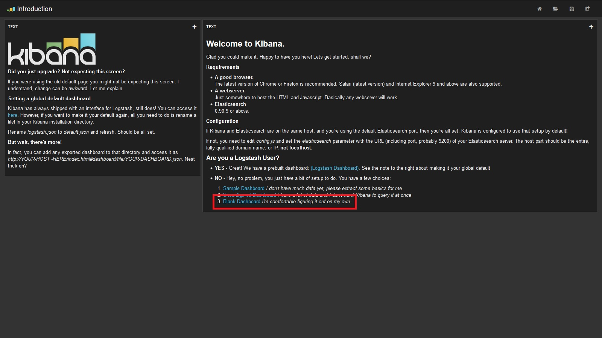
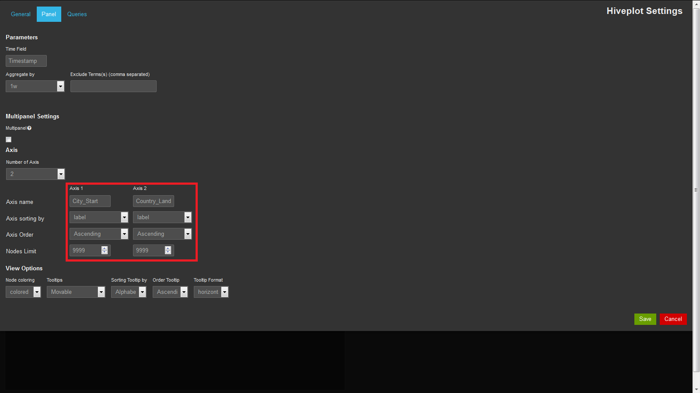

# Hive Plot Tutorial for Kibana
This tutorial explains how to use hive plot panels in Kibana and how to interpret the results.

The tutorial consists of two parts. The first part will give a short introduction into hive plots in general. If you are new to hive plots and haven’t used them before, this part will explain the 
concepts of hive plots. As hive plots are not as easy to understand as other diagrams, you should definitely read this section, if you are new to the topic. If you are already familiar with hive plots, you 
are free to skip this part and continue directly with the second part. The second part will introduce how to use hive plots in Kibana. The tutorial will use a case study to explain all important steps of 
creating and interpreting a hive plot panel. A dataset about flight information will be used for the case study.

## Introduction
Hive plot diagrams are great way of visualizing relationships between objects. However, they are not as easy to understand and interpret as other diagrams. For that reason, we will first introduce the 
hive plots. We will explain how they are related to network diagrams, why they are better than network diagrams, and how they display information.

Let’s first start with a reminder for network diagrams. Network diagrams display relationships between objects. These objects can be cities, people, or something else. For example, networks can display 
distances between cities, partnerships between sister cities or friendships between people. To create network diagrams we use algorithms, which follow some strict rules. Some of these rules are:
- Objects (in the following also called “nodes”) which have a close relationship, for example cites with small spatial distance, are also close together in the diagram.
- Objects with a high connectivity, for example people with many friends, will be located more central in the diagram.
- If the data builds groups, for example circles of friends, these groups will also be visible in the diagram by having bigger distances between the groups.

However, often it is not possible to obey all the rules at the same time as they are standing in conflict with each other. If we want to achieve rule 1, maybe it is impossible to achieve rule 2; and 
if we achieve rule 1 and 2 maybe we can’t achieve rule 3, and so on. For that reason network algorithms have always some principles of contingency. These principles of contingency help to create the network 
also if some rules are in conflict. However, we have now the problem, that networks with exactly the same data can look completely different just because of the principles of contingency. The networks have the 
same information but we cannot see if it is the same, because the diagrams look different. So if we have two different diagrams we cannot say if they are different because the data is different or because they 
just look different.

That’s where hive plots come into play.

A hive plot also displays the relations between different nodes, but the arrangement of the nodes follows stricter rules than network diagrams. And even more important: The user can define the rules 
(we will talk about that later).

### Design of a Hive Plot
Let’s check first how a hive plot looks in general. Simply put, a hive plot diagram is a circular diagram with several axes and several nodes on each axis. Nodes can only be placed on an axis and nowhere else. 
Nodes are connected via links, which represent the relation between the nodes. [Figure 1](#HiveplotFigure1) shows a generic hive plot with three axes.

**Figure 1**

Nodes and links are known concepts from network diagrams. However, the difference between a network and a hive plot is that in a hive plot the nodes have fixed places. We talked about that nodes in a network 
are arrange in a way so they represent their relation to the other nodes visually. Nodes which are close together in a network represent a high connection. For example they represent very close friends or cities 
which are close to each other. A node in the center of a network usually has a high number of connections (high connectivity). This could be the case if a person (represented by a node) has many friends.

Hive plots also provide possibilities to arrange the nodes in specific orders. Of course, as the nodes are fixed on an axis, we cannot freely change the distance between the nodes. But we can change the links in 
other ways, for example by changing the color or thickness. Instead of arranging nodes with a high connectivity in the middle of the diagram, we can assign a specific place on the axis to this node. For example, 
nodes with high connectivity should be placed at the outer border and nodes with low connectivity close to the center. A hive plot gives us even more possibilities to arrange the nodes. If we stick with the 
example of people and their friends, we could order the friends on the axis by one of their characteristics. If we want we can order them by their age or put females closer to the center and males more to the 
outer border.

Till now we have not talked about the axes which are the key characteristic of the hive plot. If we remove the axes, the nodes and links will just look like a normal network diagram. So let’s talk about it now. 
The axes are basically a way of grouping the nodes. Nodes on the same axis belong to the same group. How to select the axes depends on the task. Let’s continue with questioning friendships. If we want to know 
how often there are friendships between females and males, we can put all females on one axis and all males on another (This would result in a hive plot with only two axes). If there are hardly any connections 
between the axes, it means that there are hardly any friendships between females and males. Or we could look how many friendships there are between different cities. Each axis would represent a city, and a 
person would be placed on the axis where he/she lives. Missing connections between the axes would mean that there are not many friendships between people who live in different cities. How to choose the right 
axis and the number of axis really depends on the task. Theoretically the number of axes is unlimited but in praxis the number of axes should be kept small as it improves the readability. The number of axes 
should not exceed 4, and the best readability is guaranteed for 2 or 3 axes. If more axes are needed, it should be considered to create several hive plots with a smaller number of axes. The underlying program, 
which this tutorial is written for, is limited to 3 axes.

<table>
	<tr>
		<td>Info Box 
		In a hive plot each axis should be connectable with every other axis without crossing links and axis. If the number of axes is 4 or more some of the axes have to be duplicated or the links have to be directed 
		around the axes. Both scenarios reduce the readability of the hive plot.
		</td>
	</tr>
</table>

More information about hive plots and an example can be found on the following website:
- www.hiveplot.net
- www.konstantinkashin.com/data/hiv-hiveplot.html

## Tutorial
After we have a better understanding of hive plots now we can start with the technical tutorial. By the end of the tutorial you will have done the following things:
- Loaded data into Elasticsearch
- Created a simple hive plot for flight data
- Interpreted your first hive plot
- Arranged the nodes on axes in different ways and learned the purpose of it
- Constrained the number of nodes for an axis
- Filtered and aggregated data on a time axis
- Added an additional third axis
- Built a multi panel for comparison purposes
- Learned about the other settings

### The Dataset and Getting Data into Elasticsearch
Before we can start to build our first hive plot we have to load the required data into Elasticsearch. 
The data is loaded into Elasticsearch as JSON documents and stored as indices. The indices we will use for this tutorial are called "flightplan_short" and "flightplan_long".
In this tutorial we assume it is already known how to load data into Elasticsearch and it will not be explained further.

Let’s also take a look at the data we will be using. [Table 1](#HiveplotTable1) shows an extract of the data. 
The complete dataset is attached to this tutorial as an excel sheet and a JSON document (Please note: All numbers of the dataset are fictive and should just help for the case study).

<a name="HiveplotTable1">
<table>
	<tr>
		<td>Country_Connection</td><td>Country_Start</td><td>Country_Landing</td><td>City_Connection</td><td>City_Start</td><td>City_Landing</td><td>Timestamp</td>
	</tr>
	<tr>
		<td>Germany-Australia</td><td>Germany</td><td>Australia</td><td>Berlin-Brisbane</td><td>Berlin</td><td>Brisbane</td><td>2014-05-02T10:00:00</td>
	</tr>
	<tr>
		<td>Australia-England</td><td>Australia</td><td>England</td><td>Sydney-London</td><td>Sydney</td><td>London</td><td>2014-04-19T10:00:00</td>
	</tr>
	<tr>
		<td>England-Canada</td><td>England</td><td>Canada</td><td>Bristol-Toronto</td><td>Bristol</td><td>Toronto</td><td>2014-05-02T10:00:00</td>
	</tr>
</table>
</a>

**TABLE 1**

The dataset contains information about flights between different cities. The dataset also stores information about the day when the flight departed and the countries in which the cities are.
Although the data is fictive, it shows some kind of distribution. For example, on some days more flights are departing than on others, some cities have more flights departing 
and arriving than others, and between some countries are more connections than between others. Later we will see how these distributions are visible in the hive plot.

More information about the dataset can be seen in the excel sheet. We will now start with creating the hive plot.

### Creating a New Hive Plot Panel
Before we can can create a hive plot panel, we have to create or adjust a dashboard in Kibana and define the index which should be used for the dashboard. 
If you already know how to create a dashboard you can jump to the next chapter.

To create a new dashboard we open Kibana and select "3. Blank Dashboard" as shown on [Figure 2](#HiveplotFigure2).

**FIGURE 2**

After that we define some basic settings for the dashboard by going to *Configure dashboard* ([Figure 3](#HiveplotFigure3)).

**FIGURE 3**

We have two datasets at choice. “flightplan_long” and “flightplan_short”. The only difference between the two datasets is the value in the time field. In “flightplan_long” we have the exact timestamps 
with hours and minutes, while the “flightplan_short” has aggregated the data to the same time and there is just a difference in the days. For the start that granularity of data is good enough, 
so we go with the dataset “flightplan_short”.

We will set the *Default Index* to the index "flightplan_short" ([Figure 4](#HiveplotFigure4)) and set the *Time Field* to "Timestamp" ([Figure 5](#HiveplotFigure5)). "Timestamp" is the field in our 
data which contains the time information about our data. If you have several fields in your data which contains time information you have to select one field.

**FIGURE 4**

**FIGURE 5**

After we have changed the *Default Index* and *Time Field* we can add a new row to the dashboard. For that we go to the tab *Rows* and define the *height* of the row. 
We can also give a *title* to the row if we want. At the end we click *Create Row* and *Save* ([Figure 6](#HiveplotFigure6)).

**FIGURE 6**

Great, we have created a new dashboard with one row where we can place our hive plot panel. 

#### Designing a First Simple Hive Plot
To show a hive plot in our dashboard we have to add a panel by clicking *Add panel to empty row* ([Figure 7](#HiveplotFigure7)). 

**FIGURE 7**

In the drop-down list we select "hiveplot" ([Figure 8](#HiveplotFigure8)).

**FIGURE 8**

For the beginning we want to stick with a very simple hive plot with two axes.

Right at the beginning after we selected “hiveplot” in the drop-down list, we are asked for some settings ([Figure 9](#HiveplotFigure9)).

**FIGURE 9**

For our first simple hive plot, we don’t have to set values for all setting attributes. Some settings can remain empty or we keep the default values. The settings under the section *Stable* can stay 
like they are. If we want a bigger diagram, we can increase the number for *Span* (for example to “6”), or we can give a *Title* to the panel. But these settings are optional and don’t have to be 
considered right now.

For the *Time Field* we replace “_type” by the value we have selected before (in this example: “Timestamp”) or by any other date field in our dataset. As we have only one date field in our dataset, 
we use “Timestamp” again.

The *Aggregated by* and *Exclude Terms* fields remain like they are for the moment. Also we leave the checkbox under *Multipanel Settings* **unchecked**.

We stick with two axes and adjust the settings for the axes now. For axis1 we choose “Timestamp” and for axis2 we choose “City_Connection” in the *Axis name* row. Each of the axes represents one of the 
columns in our dataset now. Leave the values in the next two rows of the table like they are, but increase the number of *Nodes limit* under Axis2 to 9999 (we want to use a very high number here, as we don’t 
want to limit the nodes, further details for this value will be explained later).

Under *View Options* the values should be *Node coloring*: ”colored”, *Tooltips* should be “Movable”, *Sorting Tooltip by*: “Alphabetically”, *Order Tooltip*: “Ascending”, and *Tooltip Format*: "horizontal".

The settings should be like the values in [Figure 10](#HiveplotFigure10).

**FIGURE 10**

After saving the settings the dashboard will show a hive plot like the following ([Figure 11](#HiveplotFigure11)):

**FIGURE 11**

##### Reading the Hive Plot
We have created our first hive plot. Congratulations. But what does it tell us? If we count the nodes on the Timestamp axis, we should count 21. Every node represents one day in our data and as the data 
covers 3 weeks we have 21 nodes. On the City_Connection axis we have much more nodes. Every node on this axis represents a connection, for example a flight from Los Angeles to Montreal or from San Francisco 
to Sydney. And then we have hundreds of links between the nodes. If we look at the diagram it doesn’t look like single links but if we move the mouse over this area, it will highlight a single link and show 
us information about the nodes it connects. What exactly does the hive plot tell us?

The hive plot gives us information about the flights and the days when the connections are. If we move the mouse over the nodes on the Timestamp axis, it shows us how many connections there are on a specific 
day. we will see that there are much more connections on the 3rd May than on the 24th April and on the 19th April are the most connections. On the other side if we move the mouse over a node on the 
City_Connection axis, we can see when a connection between two cities is offered. For example, a flight between Los Angeles and Montreal is offered on three days. If the same connection is offered several times 
on the same day the intensity of the link changes. A yellow line indicates a weak connection between the nodes (here: few connections) and a red line indicates a strong connection. There are only a few red lines. 
For example, the connection between Paris and Melbourne is offered twice on the 4th May.

##### Sorting the Nodes on the Axes
As there are so many links and nodes in the diagram at the moment it is hard to see valuable information just by looking at it. To reveal more information we can sort the nodes on the axes. 
At the beginning we left the order of the nodes on the axis in its default case. That means that the nodes are sorted by its labels. This helps to find a specific node on the axis, but a different order 
reveals more information about the connections. To change the sorting of the axis we go back to the configure menu ([Figure 12](#HiveplotFigure12)) and change the sorting for the axes 
([Figure 13](#HiveplotFigure13)).

**FIGURE 12**

**FIGURE 13**

If we change *Axis sorting by* to “value” for the City_Connection axis, connections which are offered more often are put to the outer edge of the axis. After we changed the setting we can move the mouse over 
the node on the outer edge and we will see that the connection Sydney-Paris is offered the most often. However, there are just seven days on which the flight is offered. Are there other connections, which are 
offered on more different days? To check that out we can order the axis by “numberOfLinks”. If we do so, we will see that the connection Toronto-Melbourne is offered on more different days (8), although the 
total number of connections is less than Sydney-Paris. In sum, “value” counts the number of links in total and “numberOfLinks” counts the number of links to different nodes.

##### Limiting the Number of Nodes
By sorting the nodes we could already find some interesting information, but the hive plot is very much overloaded. Especially with regard that a dataset can contain millions of data points, we need a way to 
limit the links and nodes displayed in the hive plot. For that reason, we can reduce the number of nodes on each axis, except the time axis (for that, see 2.2.1.4)

By setting the *Nodes Limit* to “5” for axis 2 we limit the links which are calculated and displayed in the hive plot ([Figure 14](#HiveplotFigure14)). If the limit is set to 5, the hive plot just displays 
the Top5 nodes connected with the other node, but not every node connected to it. [Figure 15](#HiveplotFigure15) shows the result.

**FIGURE 14**

**FIGURE 15**

We can see that much more nodes than the 5 are displayed on the City_Connection axis, but the number of links is definitely smaller. When moving the mouse over a node on the Timestamp axis we can see that 
every point of time is just connected to a maximum of 5 cities. Also the number of red links (links with a higher connection) increased. By reducing the number of nodes we reduce also the number of less 
important links. As our data on the City_Connection axis is still sorted by “value” red links are more on the outer side and yellow links are more on the inner side. That means connections which are flown 
more often appear on the outer edge, and connections flown rarely appear on the inner side. Connections which are very rare don’t appear anymore at all.

##### Aggregating the dates
Instead of limiting the number of nodes on the Timestamp axis to a concrete number, like we did before for the City_Connection axis, we can limit the time nodes by selecting specific dates/ date ranges or by 
aggregating dates.

In the index we used till now were just 21 distinct points of time (21 days, but at every day the events happened at the same time). For that reason we can see 21 nodes on the time axis 
in [Figure 11](#HiveplotFigure11) and [Figure 15](#HiveplotFigure15). However, it is more realistic that we have hundreds of points of time. In real time data we can have an event every 
second (or even millisecond) which would result in 86,400 nodes for every day.

For the next part of the tutorial we will use the other dataset called “flightplan_long”. We can change the index by going to the configure dashboard (see [Figure 4](#HiveplotFigure4) to see how to change 
the index). If we create the hive plot with the settings from [Figure 16](#HiveplotFigure16), we get the hive plot in [Figure 17](#HiveplotFigure17). We have changed the second axis to “City_Start”, 
limited the nodes to 10, aggregated the data by 15 minutes (The default case is 1day), and ordered both axes by the labels.

**FIGURE 16**

**FIGURE 17**

The Timestamp axis displays a node for every time range of 15 minutes. That results in a very high number of nodes, but the links have a very low connectivity.

In order to reduce the number of nodes on the time axis we can aggregate the data over time intervals. To do so we go back to the configurations and change the *Aggregate by* setting 
([Figure 18](#HiveplotFigure18)).

**FIGURE 18**

We can choose between different levels of aggregations: 15 minutes, 30 minutes, 1 hour, 12 hours, 1 day, 1 week, 1 month, or 1 year. The bigger the interval we choose, the smaller the number of nodes 
appearing on the axis.

If we choose to aggregate by day, we will have 21 nodes remaining, if we aggregate by week, there will be 3 nodes.

As we left the other settings how they were before, we will also recognize a reduction of nodes on the other axis. We still just count the Top10 nodes. So if we aggregated by week we will just see the Top10 
nodes per week. ([Figure 19](#HiveplotFigure19) and [Figure 20](#HiveplotFigure20))

<table>
	<tr>
		<td>
		Info Box 
		If no interval is selected, the data are always automatically aggregated by second. So, milliseconds are never considered in the diagram.
		</td>
	</tr>
</table>

If we move the mouse over the node on the time axis again, the shown date indicates the start of the time interval.

Although the nodes on the Timestamp axis are sorted by the label we can see which week is the busiest one in [Figure 19](#HiveplotFigure19). The number of red links is the first indicator of a highly 
connected node. The first week (the one close to the center) has more red links than the other ones. So, we can expect that this week is the busiest one. If we move the mouse over the nodes we see by the 
values that we were correct. Of course the red lines are just an indicator. Let's imagine there would be 2 red links from the one node, but another node has 10 yellow links. In this case the total value 
could be still the same. So, to be sure it is better to sort the nodes by their value.

**FIGURE 19**

**FIGURE 20**

##### Filtering Data
The data in the hive plot can be filtered easily by interacting with the diagram. By clicking on one of the nodes we filter the data to this node. If we click on a node on the time axis and the time is 
aggregated over an interval, the data is filtered to the data which has a timestamp falling into this interval.

By aggregating and filtering the time axis we can easily filter the time to specific time ranges. For example, if we want to have the data for a specific day aggregated by the hours, we first group the data 
by day, click on the node for the day we wish and aggregate the data afterwards by the hour.

The hive plot can also be filtered by the filter function of Kibana. To set a filter we can create a filter query like the one in [Figure 21](#HiveplotFigure21).

**FIGURE 21**

Let’s use the filter to get a closer look into the flight plans of France. We changed the settings to the following from [Figure 22](#HiveplotFigure22): axis 1 is “City_Start”, axis 2 is “Country_Landing”, 
and for both axes we don’t have a limit for the nodes. As we just want to see the connections starting in France we set a filter like the one in [Figure 23](#HiveplotFigure23).

If we look at the hive plot ([Figure 24](#HiveplotFigure24)), we will see that there is one city from where we have connections to much more countries than from the other ones. By moving the mouse over 
the node we see that this is the airport in Paris.

**FIGURE 22**

**FIGURE 23**

**FIGURE 24**

By now we have learned how to create a hive plot, how to sort and aggregate the data, and how to limit the number of nodes and links. Now we want to add a third axis to our diagram.

#### Adding a third Axis
A third axis can be added in the configurations. To add a third axis we have to change the setting for *Number of Axis* to “3” and fill the fields for the third axis. In our example we chose “Country_Start” 
and also set the *Nodes Limit* to 10. We changed the settings for axis 1 and 2 back to “Timestamp” and “City_Start” ([Figure 25](#HiveplotFigure25)). We also removed the filter for France.

**FIGURE 25**

The new hive plot will look like [Figure 26](#HiveplotFigure26).

**FIGURE 26**

We can see that each node on the Timestamp axis is again connected to a maximum of 10 nodes on the Country_Start axis, and each node on the Country_Start axis is connected to a maximum of 10 nodes on the 
City_Start axis. Each node on the City_Start axis would also be connected to a maximum of 10 nodes on the Country_Start axis, but of course each city is just within one country, so there is also just 
exactly one connection.

If we reduce the *Nodes Limit* for axis 2 to "5", the connections to axis 1 as well as axis 3 would be reduced (see [Figure 27](#HiveplotFigure27)).

**FIGURE 27**

#### Creating a Multipanel-Hive Plot
Sometimes it is interesting to compare data from different time perspectives. For example, we would like to see how the flight traffic was on different days. Therefore, we can select the *Multipanel Setting* 
in the configurations ([Figure 28](#HiveplotFigure28)). We selected that we want a new panel for every day and we also changed some settings on the axes.

**FIGURE 28**

As the new hive plots we get [Figure 29](#HiveplotFigure29).

**FIGURE 29**

We can see that there are days with more traffic (many connections) and days with less traffic. The days marked in red have a higher traffic rate than the other. A reason for that could be that these days are 
weekends or the days before and after holidays.

For the settings of “1 week” and aggregating by the day we get a hive plot like the one in [Figure 30](#HiveplotFigure30).

**FIGURE 30**

##### Setting the Compare Mode
At the moment the nodes which are displayed on the axis are different in each hive plot of [Figure 30](#HiveplotFigure30). Each hive plot just shows the nodes occurring in the week the hiveplot is made for. 
For a better comparability of the plots we select the *Compare Mode* by checking the checkbox ([Figure 31](#HiveplotFigure31)).

**FIGURE 31**

The new diagram shows the same nodes on each axis ([Figure 32](#HiveplotFigure32)). This can help in some situations to get a better comparability for the plots. In this case we can see that there are not 
many differences between the three weeks.

**FIGURE 32**

### Other Settings
There are some more settings we can change ([Figure 33](#HiveplotFigure33)). The main purposes of these settings are design changes, but they don’t add further functionalities. We can choose to color the nodes or leave them 
black-white, and we can order the information in the tooltip. If we don’t wish to show tooltips we can also disable them.

**FIGURE 33**