# Tutorial for a Network Diagram in Kibana
In this tutorial we will go through the process of creating and interpreting network diagrams in Kibana.

<a name="NetworkFigure1">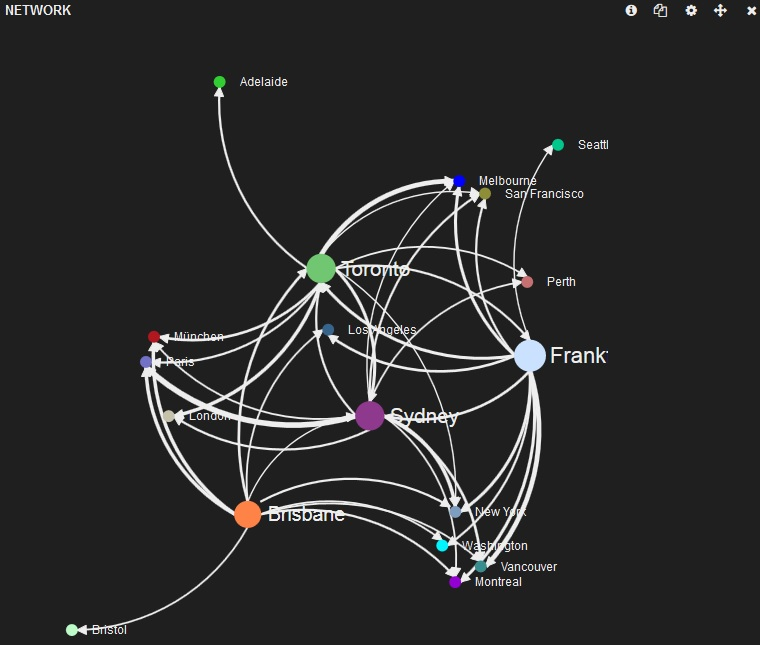</a>

**FIGURE 1**

To get the best learning experience the tutorial is built in form of a case study about flight plans between different countries and cities. 
During the tutorial we will built the network diagram and change some aspects of the layout for the diagram as we go along. 
When we are changing the layout we are doing so with specific questions about the data in mind.

At the end of the tutorial we will have done the following things:
- Loaded data into Elastcisearch
- Created a network diagram
- Modified the settings to best suit the asked question about the data

## The Dataset and Getting Data into Elasticsearch
Before we can start to build our first network diagram we have to load the required data into Elasticsearch. 
The data is loaded into Elasticsearch as JSON documents and stored as indices. The index we will use for this tutorial is called "flightplan_short".
In this tutorial we assume it is already known how to load data into Elasticsearch and it will not be explained further.

Let’s also take a look at the data we will be using. [Table 1](#NetworkTable1) shows an extract of the data. 
The complete dataset is attached to this tutorial as an excel sheet and a JSON document (Please note: All numbers of the dataset are fictive and should just help for the case study).

<a name="NetworkTable1">
<table>
	<tr>
		<td>Country_Connection</td><td>Country_Start</td><td>Country_Landing</td><td>City_Connection</td><td>City_Start</td><td>City_Landing</td><td>Timestamp</td>
	</tr>
	<tr>
		<td>Germany-Australia</td><td>Germany</td><td>Australia</td><td>Berlin-Brisbane</td><td>Berlin</td><td>Brisbane</td><td>2014-05-02T10:00:00</td>
	</tr>
	<tr>
		<td>Australia-England</td><td>Australia</td><td>England</td><td>Sydney-London</td><td>Sydney</td><td>London</td><td>2014-04-19T10:00:00</td>
	</tr>
	<tr>
		<td>England-Canada</td><td>England</td><td>Canada</td><td>Bristol-Toronto</td><td>Bristol</td><td>Toronto</td><td>2014-05-02T10:00:00</td>
	</tr>
</table>
</a>

**TABLE 1**

The dataset contains information about flights between different cities. The dataset also stores information about the day when the flight departed and the countries in which the cities are.
Although the data is fictive, it shows some kind of distribution. For example, on some days more flights are departing than on others, some cities have more flights departing 
and arriving than others, and between some countries are more connections than between others. Later we will see how these distributions are visible in the network diagram.

More information about the dataset can be seen in the excel sheet. We will now start with creating the network diagram.

## Creating a New Network Diagram Panel
Before we can can create a network diagram panel, we have to create or adjust a dashboard in Kibana and define the index which should be used for the dashboard. 
If you already know how to create a dashboard you can jump to the next chapter.

To create a new dashboard we open Kibana and select "3. Blank Dashboard" as shown on [Figure 2](#NetworkFigure2).

<a name="NetworkFigure2">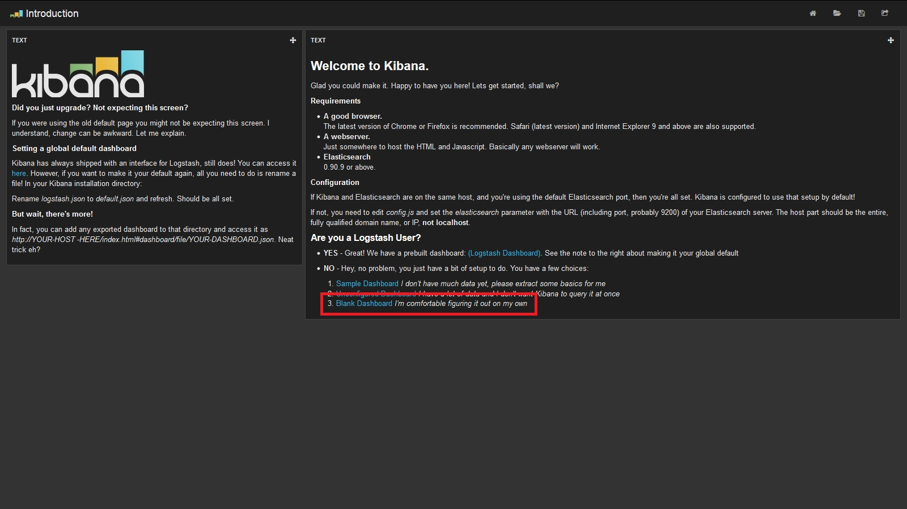</a>

**FIGURE 2**

After that we define some basic settings for the dashboard by going to *Configure dashboard* ([Figure 3](#NetworkFigure3)).

**FIGURE 3**

We will set the *Default Index* to our index "flightplan_short" ([Figure 4](#NetworkFigure4)) and set the *Time Field* to "Timestamp" ([Figure 5](#NetworkFigure5)). "Timestamp" is the field in our 
data which contains the time information about our data. If you have several fields in your data which contains time information you have to select one field.

<a name="NetworkFigure4">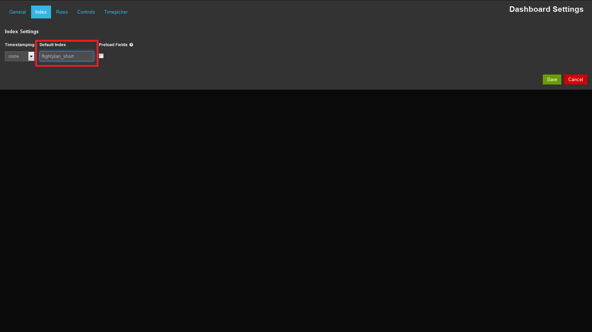</a>

**FIGURE 4**

<a name="NetworkFigure5">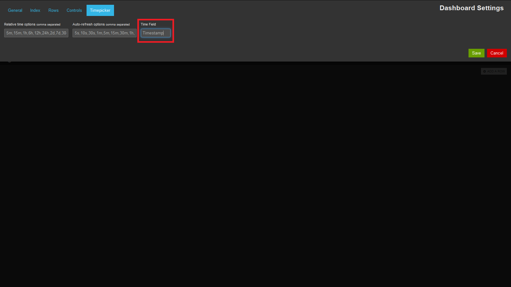</a>

**FIGURE 5**

After we have changed the *Default Index* and *Time Field* we can add a new row to the dashboard. For that we go to the tab *Rows* and define the *height* of the row. 
We can also give a *title* to the row if we want. At the end we click *Create Row* and *Save* ([Figure 6](#NetworkFigure6)).

<a name="NetworkFigure6">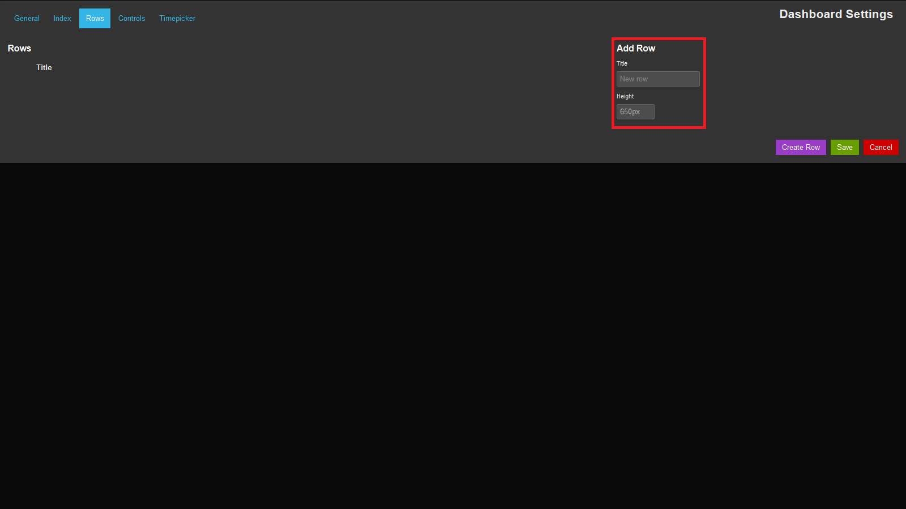</a>

**FIGURE 6**

Great, we have created a new dashboard with one row where we can place our network diagram panel. 

## Creating a Network Diagram
To show a newtork diagram in our dashboard we have to add a panel by clicking *Add panel to empty row* ([Figure 7](#NetworkFigure7)). 

<a name="NetworkFigure7">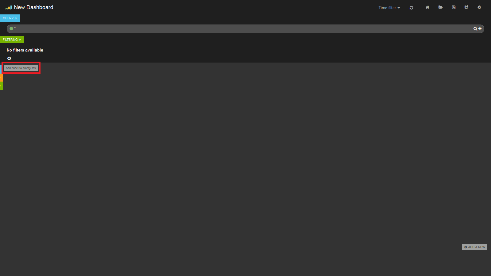</a>

**FIGURE 7**

In the drop-down list we select "network" ([Figure 8](#NetworkFigure8)).

<a name="NetworkFigure8">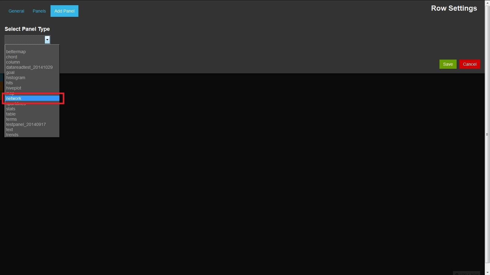</a>

**FIGURE 8**

We are now asked for some settings for our network diagram ([Figure 9](#NetworkFigure9)). For the beginning we will leave most of the fields in the default state. 
We resize the panel to "6" under *Span* and change some of the parameters. We will change the *Source Field* to “Country_Start” and its 
length to "9999". We also change the *Target Field* to "Country_Landing" and the length to "9999". Everything else remains in the default state ([Figure 10](#NetworkFigure10)).

<a name="NetworkFigure8">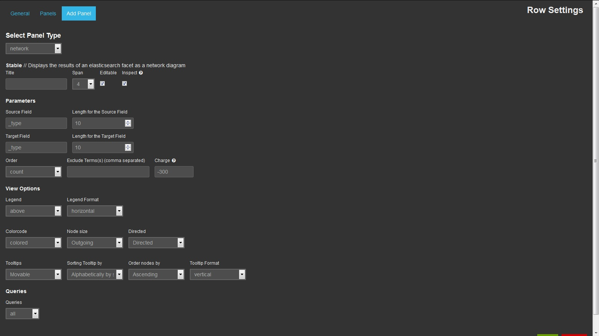</a>

**FIGURE 9**

<a name="NetworkFigure10">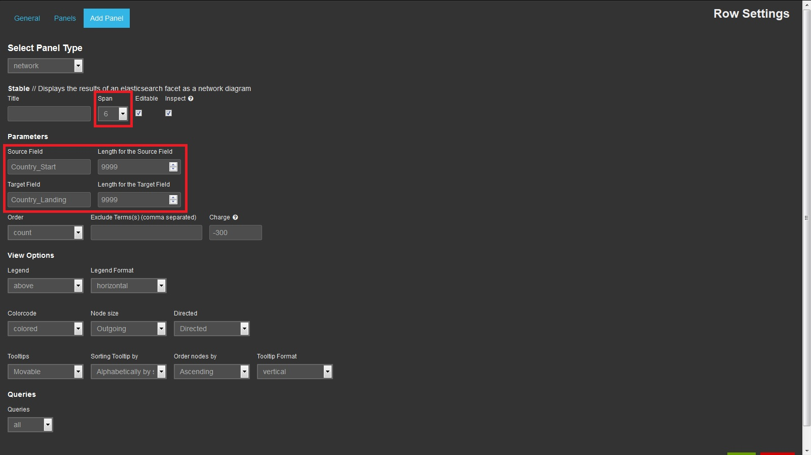</a>

**FIGURE 10**

After we have saved our changes we get a diagram like the one in [Figure 11](#NetworkFigure11).

<a name="NetworkFigure11">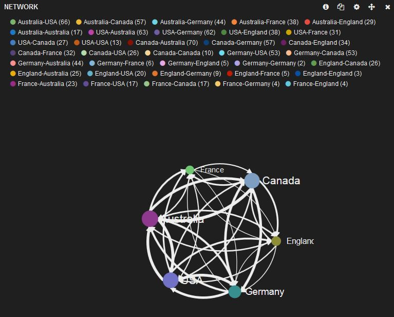</a>

**FIGURE 11**

The network shows us different information about the flight plans. The size of the nodes and font correlates with the number of flights departing from the country. So, a bigger node stands for a 
country with more departing flights. The thickness of the arrows represents the number of flights between two countries. As we can see the link between Australia and the USA is thicker than the 
one between Germany and France, which means that more flights are going from Australia to the USA. The current diagram also shows the direction of the flights. Flights from the USA to Australia 
are represented by a different arrow than flights from Australia to the USA.

## Changing the Node Size and Arrows
At the moment the nodesize represents the flights departing in a country. If we want that the node size correlates with the number of arriving flights we can change that by setting *Node size* to "Incoming" 
([Figure 12](#NetworkFigure12)).

<a name="NetworkFigure12">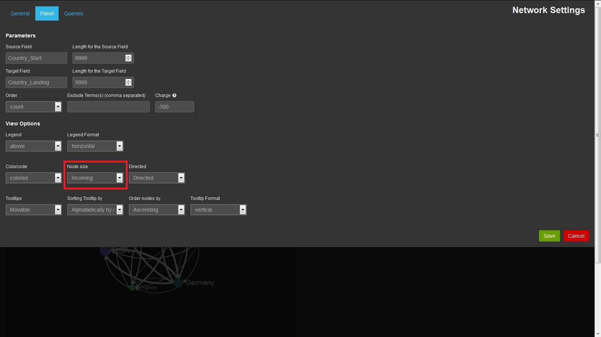</a>

**FIGURE 12**

The resulting network ([Figure 13](#NetworkFigure13)) looks very similar, but we can see that the size of the node for France is a bit bigger for the incoming flights. This means, that more flights are 
landing in France than departing. 

**FIGURE 13**

If we don't want to see the number of flights dependent on the direction we can summarize these data and show them as single link. In this case also the size of the node correlates to the total number of flights 
between the two countries. To do so we change *Directed* to "Undirected" ([Figure 14](#NetworkFigure14)).

<a name="NetworkFigure14">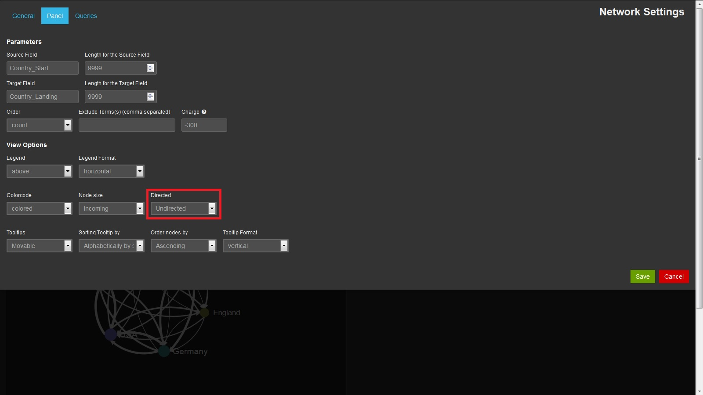</a>

**FIGURE 14**

[Figure 15](#NetworkFigure15) is the resulting network.

<a name="NetworkFigure15">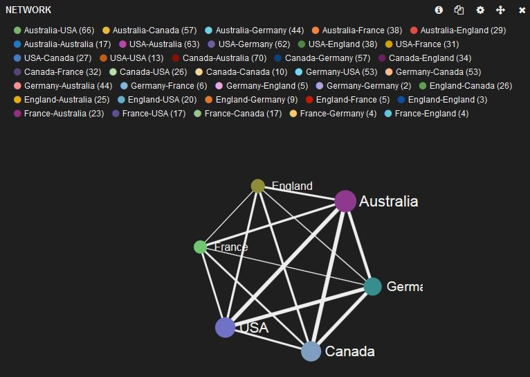</a>

**FIGURE 15**

## Filtering Data
Under certain circumstances it is not a good idea to use all data. If we use the settings from [Figure 16](#NetworkFigure16) we get a network diagram with all connections between each city. 
Let's say we just want to know the 4 cities which have the most departures and we want to see the cities where the flights are going to. 
Therefore we change the settings to the ones shown in [Figure 17](#NetworkFigure17).

<a name="NetworkFigure16">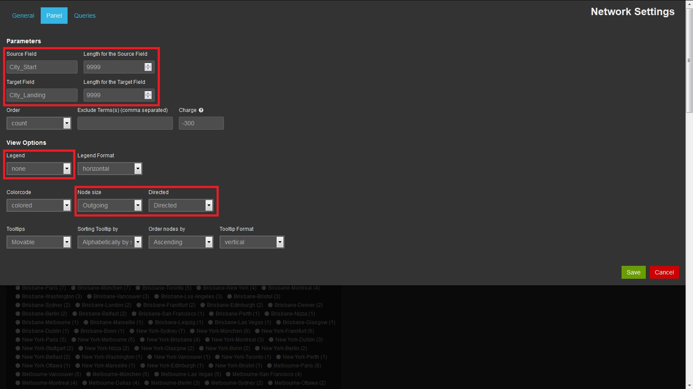</a>

**FIGURE 16**

<a name="NetworkFigure17">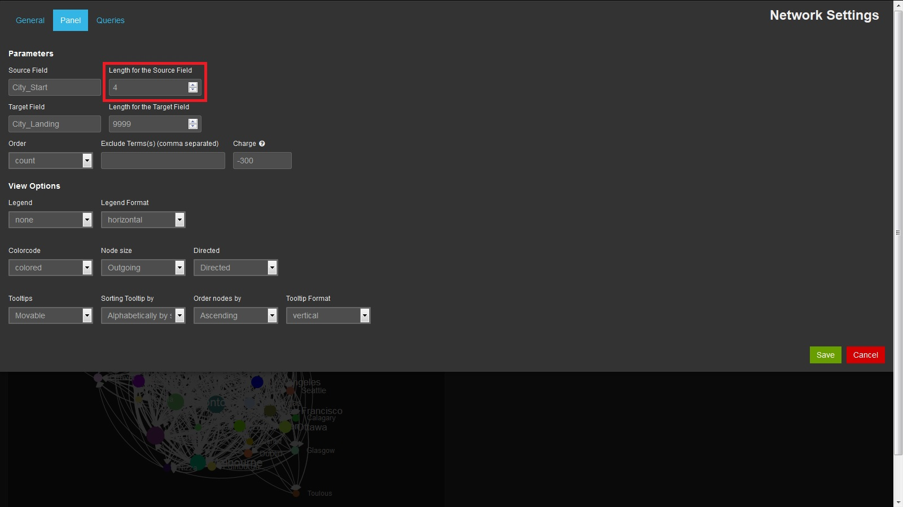</a>

**FIGURE 17**

The big nodes in the middle of the diagram ([Figure 18](#NetworkFigure18)) represent the Top4 cities with the most departing flights. It also shows us the cities where the flights are going to, but no other 
flights which are leaving from these cities. So, by changing the *Length for the Source Field* or the *Length for the Target Field* we can reduce the number of nodes which should be shown and put the focus 
on some specific ones.

<a name="NetworkFigure18">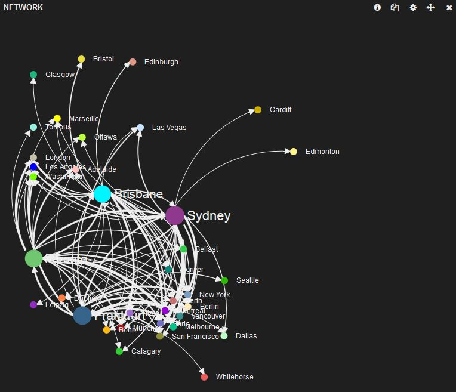</a>

**FIGURE 18**

Another way to filter the data is to use the filter function of Kibana. If we want to see the Top4 cities within the USA we can set a filter like the one in [Figure 19](#NetworkFigure19).

<a name="NetworkFigure19">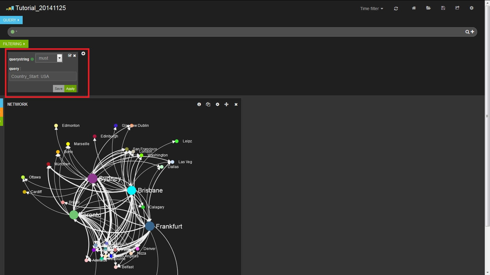</a>

**FIGURE 19**

[Figure 20](#NetworkFigure20) shows us the Top4 cities in the USA and its connections to all cities in the world.

<a name="NetworkFigure20">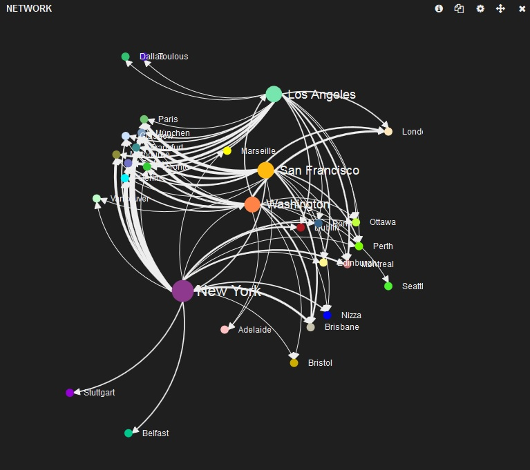</a>

**FIGURE 20**

If we set another filter "Country_Landing: USA" we will get the Top4 cities in the USA rgearding the flights within the USA. [Figure 21](#NetworkFigure21) shows us a new image on the data.

<a name="NetworkFigure21">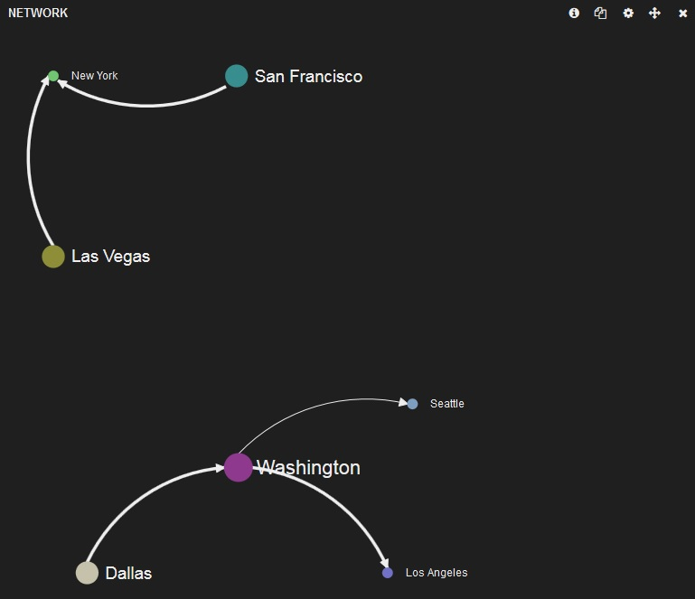</a>

**FIGURE 21**

If we compare [Figure 20](#NetworkFigure20) and [Figure 21](#NetworkFigure21), we see that the Top4 cities regarding international flights are different ones than regarding domestic flights. The Top4 cities 
for international flights are New York, San Francisco, Los Angeles and Washington, while the Top4 for domestic flights are Washington, San Francisco, Las Vegas and Dallas.

## Changing the Tooltip and the Charge
While we have gone through the tutorial you have probably recognized that a tooltip appears, if we move the mouse over a node or a link. We can also change the settings for the toolip 
in the configurations ([Figure 22](#NetworkFigure22)).
  
<a name="NetworkFigure22">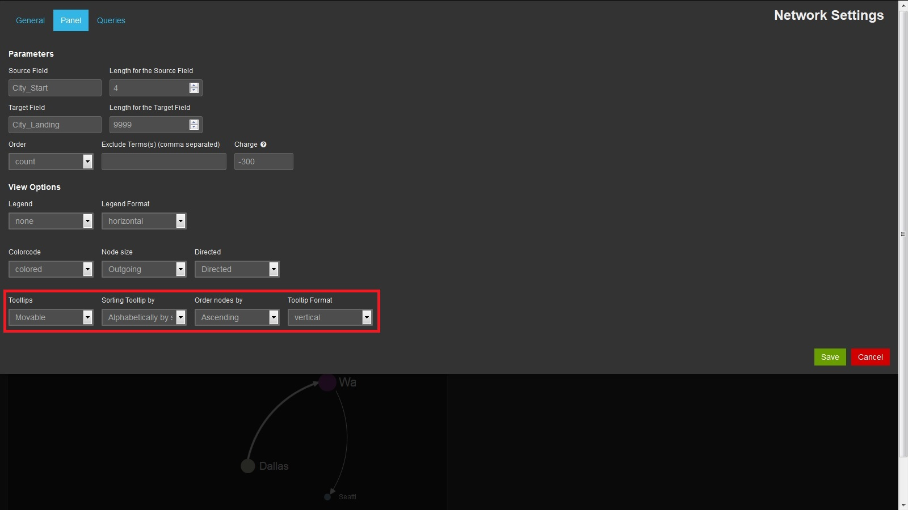</a>

**FIGURE 22**

We can define if the tooltip should not be shown at all, if it should be shown as a movable box or on the side of the diagram. We can also define how the information in the tooltip is shown.

To change the distance between the nodes in the diagram we can change the *charge* ([Figure 23](#NetworkFigure23)). A higher value will try to put the nodes closer together and a 
lower will push the nodes farer away. More information about *charge* can be found on the website bl.ocks.org/sathomas/1ca23ee9588580d768aa . It is recommended to leave the value with "-300" 
and only to change the value if you are familiar with the concepts of "charge".

<a name="NetworkFigure23">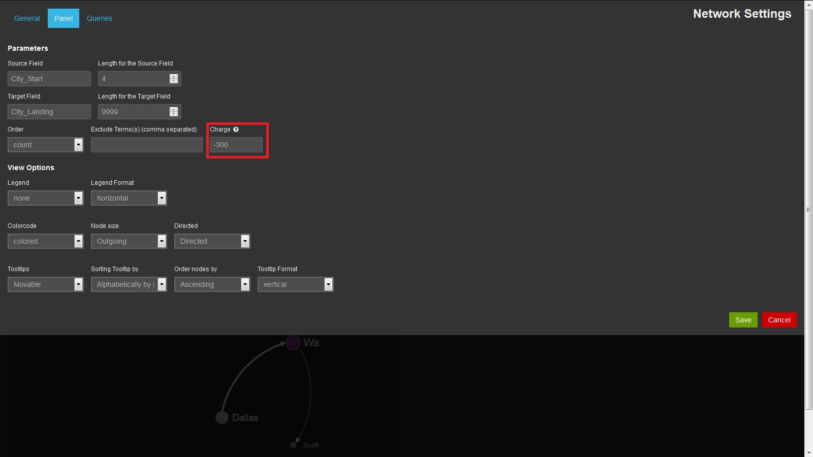</a>

**FIGURE 23**